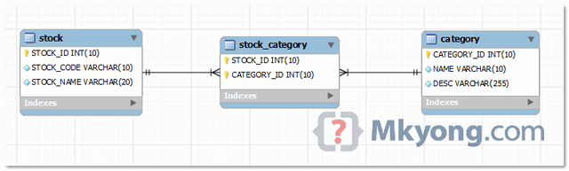

## 第1章 Hibernate_day03 笔记

### 1.1	上次课内容回顾

#### Hibernate的持久化类的编写规则

- 无参数构造
- 属性私有
- 属性尽量使用包装类
- 提供一个唯一 OID 与主键对应
- 不要使用 final 修饰

#### Hibernate的主键生成策略

- 主键分类
  - 自然主键
  - 代理主键
- 主键生成策略
  - increment
  - identity
  - sequence
  - uuid
  - native
  - assigned
  - foreign
#### Hibernate的持久化类的三种状态
- 瞬时态：没有唯一标识 OID，没有被 session 管理
- 持久态：有唯一标识 OID，已经被 session 管理
- 脱管态：有唯一标识 OID，没有被 session 管理
- 状态转换：（了解）
#### Hibernate的一级缓存
- 一级缓存：Hibernate 优化手段，称为是session级别缓存。
- 一级缓存：快照区
#### Hibernate的事务管理
- 事务的回顾
  - 事务的概念
  - 事务的特性
  - 引发安全性问题
  - 安全性问题解决
- Hibernate 解决读问题
  - 配置设置隔离级别
- Hibernate 解决 Service 事务
  - 采用的是「线程绑定」的方式：
#### Hibernate的其他的API
- Query	  : HQL 面向对象方式的查询。

- Criteria: QBC 完成面向对象化。

- SQLQuery: SQL 查询

###   1.2 Hibernate的一对多关联映射

####   1.2.1 数据库表与表之间的关系

#####   1.2.1.1 一对多关系

######   什么样关系属于一对多？

- 一个部门对应多个员工，一个员工只能属于某一个部门。
- 一个客户对应多个联系人，一个联系人只能属于某一个客户。

###### 一对多的建表原则：在多的一方创建外键指向一方的主键


##### 1.2.1.2 多对多关系

###### 什么样关系属于多对多？

- 一个学生可以选择多门课程，一门课程也可以被多个学生选择。
- 一个用户可以选择多个角色，一个角色也可以被多个用户选择。

###### 多对多的建表原则：



##### 1.2.1.3 一对一关系（了解）

######   什么样关系属于一对一？

- 一个公司只能有一个注册地址，一个注册地址只能被一个公司注册。
- 一个人只能有一个身份证号

###### 一对一的建表原则：


#### 1.2.2	Hibernate 一对多的关系配置

##### 1.2.2.1 创建一个项目，引入相应 jar 包

##### 1.2.2.2 创建数据库和表

```sql
CREATE TABLE `cst_customer` (
	`cust_id` bigint(32) NOT NULL AUTO_INCREMENT COMMENT '客户编号(主键)',
	`cust_name` varchar(32) NOT NULL COMMENT '客户名称(公司名称)',
	`cust_source` varchar(32) DEFAULT NULL COMMENT '客户信息来源',
	`cust_industry` varchar(32) DEFAULT NULL COMMENT '客户所属行业',
	`cust_level` varchar(32) DEFAULT NULL COMMENT '客户级别',
	`cust_phone` varchar(64) DEFAULT NULL COMMENT '固定电话',
	`cust_mobile` varchar(16) DEFAULT NULL COMMENT '移动电话',
	PRIMARY KEY (`cust_id`)
) ENGINE = InnoDB AUTO_INCREMENT = 1 CHARSET = utf8;
```

```sql
CREATE TABLE `cst_linkman` (
  `lkm_id` bigint(32) NOT NULL AUTO_INCREMENT COMMENT '联系人编号(主键)',
  `lkm_name` varchar(16) DEFAULT NULL COMMENT '联系人姓名',
  `lkm_cust_id` bigint(32) NOT NULL COMMENT '客户id',
  `lkm_gender` char(1) DEFAULT NULL COMMENT '联系人性别',
  `lkm_phone` varchar(16) DEFAULT NULL COMMENT '联系人办公电话',
  `lkm_mobile` varchar(16) DEFAULT NULL COMMENT '联系人手机',
  `lkm_email` varchar(64) DEFAULT NULL COMMENT '联系人邮箱',
  `lkm_qq` varchar(16) DEFAULT NULL COMMENT '联系人qq',
  `lkm_position` varchar(16) DEFAULT NULL COMMENT '联系人职位',
  `lkm_memo` varchar(512) DEFAULT NULL COMMENT '联系人备注',
  PRIMARY KEY (`lkm_id`),
  KEY `FK_cst_linkman_lkm_cust_id` (`lkm_cust_id`),
  CONSTRAINT `FK_cst_linkman_lkm_cust_id` FOREIGN KEY (`lkm_cust_id`) REFERENCES `cst_customer` (`cust_id`) ON DELETE NO ACTION ON UPDATE NO ACTION
) ENGINE=InnoDB AUTO_INCREMENT=1 DEFAULT CHARSET=utf8;
```
#####   1.2.2.3 创建实体

###### 一的一方的实体

```java
public class Customer {
    private Long cust_id;
    private String cust_name;
    private String cust_source;
    private String cust_industry;
    private String cust_level;
    private String cust_phone;
    private String cust_mobile;
    // 通过ORM方式表示：一个客户对应多个联系人。
    // 放置的多的一方的集合。Hibernate默认使用的是Set集合。
```

###### 多的一方的实体

```java
public class LinkMan {
    private Long lkm_id;
    private String lkm_name;
    private String lkm_gender;
    private String lkm_phone;
    private String lkm_mobile;
    private String lkm_email;
    private String lkm_qq;
    private String lkm_position;
    private String lkm_memo;
    // 通过ORM方式表示：一个联系人只能属于某一个客户。
    // 放置的是一的一方的对象。
```

#####   1.2.2.4 创建映射文件

###### 多的一方的映射的创建

```xml
<?xml version="1.0" encoding="UTF-8"?>
<!DOCTYPE hibernate-mapping PUBLIC
        "-//Hibernate/Hibernate Mapping DTD 3.0//EN"
        "http://www.hibernate.org/dtd/hibernate-mapping-3.0.dtd">
<hibernate-mapping>
    <class name="com.hibernate.domain.LinkMan" table="cst_linkman">
        <!-- 建立OID与主键映射 -->
        <id name="lkm_id" column="lkm_id">
            <generator class="native"/>
        </id>
        <!-- 建立普通属性与表字段映射 -->
        <property name="lkm_name"/>
        <property name="lkm_gender"/>
        <property name="lkm_phone"/>
        <property name="lkm_mobile"/>
        <property name="lkm_email"/>
        <property name="lkm_qq"/>
        <property name="lkm_position"/>
        <property name="lkm_memo"/>
        <!-- 配置多对一的关系：放置的是一的一方的对象 -->
        <!--
            many-to-one标签
                * name		:一的一方的对象的属性名称。
                * class		:一的一方的类的全路径。
                * column	:在多的一方的表的外键的名称。
         -->
        <many-to-one name="customer" class="com.hibernate.domain.Customer" column="lkm_cust_id"/>
    </class>
</hibernate-mapping>
```

###### 一的一方的映射的创建

```xml
<?xml version="1.0" encoding="UTF-8"?>
<!DOCTYPE hibernate-mapping PUBLIC
        "-//Hibernate/Hibernate Mapping DTD 3.0//EN"
        "http://www.hibernate.org/dtd/hibernate-mapping-3.0.dtd">
<hibernate-mapping>
    <class name="com.hibernate.domain.Customer" table="cst_customer">
        <!-- 建立OID与主键映射 -->
        <id name="cust_id" column="cust_id">
            <generator class="native"/>
        </id>
        <!-- 建立普通属性与数据库表字段映射 -->
        <property name="cust_name" column="cust_name"/>
        <property name="cust_source" column="cust_source"/>
        <property name="cust_industry" column="cust_industry"/>
        <property name="cust_level" column="cust_level"/>
        <property name="cust_phone" column="cust_phone"/>
        <property name="cust_mobile" column="cust_mobile"/>
        <!-- 配置一对多的映射：放置的多的一方的集合 -->
        <!--
            set标签 ：
                * name	：多的一方的对象集合的属性名称。
                * cascade：级联
                * inverse：放弃外键维护权。
        -->
        <set name="linkMans" cascade="save-update" inverse="true">
            <!--
                 key标签
                    * column：多的一方的外键的名称。
             -->
            <key column="lkm_cust_id"/>
            <!--
                one-to-many标签
                    * class	:多的一方的类的全路径
             -->
            <one-to-many class="com.hibernate.domain.LinkMan"/>
        </set>
    </class>
</hibernate-mapping>
```

#####   1.2.2.5 创建核心配置文件

先添加 `org.hibernate.connection` 来配置 C3P0

```xml
<?xml version="1.0" encoding="UTF-8"?>
<!DOCTYPE hibernate-configuration PUBLIC
        "-//Hibernate/Hibernate Configuration DTD 3.0//EN"
        "http://www.hibernate.org/dtd/hibernate-configuration-3.0.dtd">
<hibernate-configuration>
    <session-factory>
        <!-- 连接数据库的基本参数 -->
        <property name="hibernate.connection.driver_class">
            com.mysql.jdbc.Driver
        </property>
        <property name="hibernate.connection.url">
            jdbc:mysql://localhost:3306/User
        </property>
        <property name="hibernate.connection.username">
            root
        </property>
        <property name="hibernate.connection.password">
            canton0520
        </property>
        <property name="hibernate.dialect">
            org.hibernate.dialect.MySQLDialect
        </property>
        <!-- Optional -->
        <!-- 打印SQL -->
        <property name="hibernate.show_sql">true</property>
        <!-- 格式化SQL -->
        <property name="hibernate.format_sql">true</property>
        <!-- 自动创建表 -->
        <property name="hibernate.hbm2ddl.auto">update</property>

        <!-- 配置C3P0连接池 -->
        <property name="connection.provider_class">
            org.hibernate.connection.C3P0ConnectionProvider
        </property>

        <!--在连接池中可用的数据库连接的最少数目 -->
        <property name="c3p0.min_size">5</property>
        <!--在连接池中所有数据库连接的最大数目  -->
        <property name="c3p0.max_size">20</property>
        <!--设定数据库连接的过期时间,以秒为单位,
        如果连接池中的某个数据库连接处于空闲状态的时间超过了timeout时间,就会从连接池中清除 -->
        <property name="c3p0.timeout">120</property>
        <!--每3000秒检查所有连接池中的空闲连接 以秒为单位-->
        <property name="c3p0.idle_test_period">3000</property>

        <!--设置事务隔离级别-->
        <property name="hibernate.connection.isolation">
            4
        </property>
        <property name="hibernate.current_session_context_class">
            thread
        </property>
        <!--引入映射-->
        <mapping resource="com/hibernate/domain/Customer.hbm.xml"/>
        <mapping resource="com/hibernate/domain/LinkMan.hbm.xml"/>
    </session-factory>
</hibernate-configuration>
```

必须要设置事务隔离级别

#####   1.2.2.6 引入工具类

```java
public class HibernateUtils {
    public static final Configuration cfg;
    public static final SessionFactory sf;

    static {
        cfg = new Configuration().configure();
        sf = cfg.buildSessionFactory();
    }

    public static Session openSession() {
        return sf.openSession();
    }

    public static Session getCurrentSession() {
        return sf.getCurrentSession();
    }
}
```

#####   1.2.2.7 编写测试类

```java
public class HibernateDemo1 {
    @Test
    // 保存2个客户和3个联系人并且建立好关系
    public void demo1() {
        Session session = HibernateUtils.getCurrentSession();
        Transaction tx = session.beginTransaction();

        // 创建两个客户
        Customer customer1 = new Customer();
        customer1.setCust_name("王东");
        Customer customer2 = new Customer();
        customer2.setCust_name("赵洪");

        // 创建三个联系人
        LinkMan linkMan1 = new LinkMan();
        linkMan1.setLkm_name("凤姐");
        LinkMan linkMan2 = new LinkMan();
        linkMan2.setLkm_name("如花");
        LinkMan linkMan3 = new LinkMan();
        linkMan3.setLkm_name("旺财");

        // 设置关系:
        linkMan1.setCustomer(customer1);
        linkMan2.setCustomer(customer1);
        linkMan3.setCustomer(customer2);
        customer1.getLinkMans().add(linkMan1);
        customer1.getLinkMans().add(linkMan2);
        customer2.getLinkMans().add(linkMan3);

        // 保存数据:
        session.save(linkMan1);
        session.save(linkMan2);
        session.save(linkMan3);
        session.save(customer1);
        session.save(customer2);

        tx.commit();
    }
}
```

####   1.2.3 Hibernate 的一对多相关操作

#####   1.2.3.1 一对多关系只保存一边是否可以：

```java
@Test
// 一对多关系只保存一边是否可以
public void demo2() {
    Session session = HibernateUtils.getCurrentSession();
    Transaction tx = session.beginTransaction();
    Customer customer = new Customer();
    customer.setCust_name("赵洪");
    LinkMan linkMan = new LinkMan();
    linkMan.setLkm_name("如花");
    customer.getLinkMans().add(linkMan);
    linkMan.setCustomer(customer);
    // 只保存一边是否可以：不可以，报一个瞬时对象异常：持久态对象关联了一个瞬时态对象。
    session.save(linkMan);
    tx.commit();
}
```

#####   1.2.3.2 一对多的级联操作

###### 什么叫做级联

- 级联指的是，操作一个对象的时候，是否会同时操作其关联的对象。

###### 级联是有方向性

- 操作一的一方的时候，是否操作到多的一方

- 操作多的一方的时候，是否操作到一的一方

##### 1.2.3.3 级联保存或更新

###### 保存客户级联联系人

```xml
<set name="linkMans" cascade="save-update" inverse="true">
```

```java
public void demo3() {
    Session session = HibernateUtils.getCurrentSession();
    Transaction tx = session.beginTransaction();
    Customer customer = new Customer();
    customer.setCust_name("赵洪");
    LinkMan linkMan = new LinkMan();
    linkMan.setLkm_name("如花");
    customer.getLinkMans().add(linkMan);
    linkMan.setCustomer(customer);
    session.save(customer);
    tx.commit();
}
```

###### 保存联系人级联客户

```xml
<many-to-one name="customer" cascade="save-update" class="com.hibernate.domain.Customer" column="lkm_cust_id"/>
```

```java
public void demo4() {
    Session session = HibernateUtils.getCurrentSession();
    Transaction tx = session.beginTransaction();
    Customer customer = new Customer();
    customer.setCust_name("李兵");
    LinkMan linkMan = new LinkMan();
    linkMan.setLkm_name("凤姐");
    customer.getLinkMans().add(linkMan);
    linkMan.setCustomer(customer);
    session.save(linkMan);
    tx.commit();
}
```

##### 1.2.3.4 测试对象的导航

```java
public void demo5() {
    Session session = HibernateUtils.getCurrentSession();
    Transaction tx = session.beginTransaction();
    Customer customer = new Customer();
    customer.setCust_name("李兵");
    LinkMan linkMan1 = new LinkMan();
    linkMan1.setLkm_name("凤姐");
    LinkMan linkMan2 = new LinkMan();
    linkMan2.setLkm_name("如花");
    LinkMan linkMan3 = new LinkMan();
    linkMan3.setLkm_name("芙蓉");
    linkMan1.setCustomer(customer);
    customer.getLinkMans().add(linkMan2);
    customer.getLinkMans().add(linkMan3);
    // 双方都设置了cascade
    // session.save(linkMan1); // 发送几条insert语句  4条
    // session.save(customer); // 发送几条insert语句  3条
    session.save(linkMan2); // 发送几条insert语句  1条
    tx.commit();
}
```

##### 1.2.3.5 级联删除

###### 级联删除：

- 删除一边的时候，同时将另一方的数据也一并删除。

###### 删除客户级联删除联系人

```java
public void demo6() {
    Session session = HibernateUtils.getCurrentSession();
    Transaction tx = session.beginTransaction();
    // 没有设置级联删除，默认情况:修改了联系人的外键，删除客户
    Customer customer = session.get(Customer.class, 1l);
    session.delete(customer);
    // 删除客户，同时删除联系人
    Customer customer = session.get(Customer.class, 1l);
    session.delete(customer);
    tx.commit();
}
```

###### 删除联系人级联删除客户（基本不用）

```java
@Test
/**
 * 级联删除：
 * 删除联系人级联删除客户，删除的主体是联系人，需要在LinkMan.hbm.xml中配置
 * <many-to-one name="customer" cascade="delete">
 */
public void demo7() {
    Session session = HibernateUtils.getCurrentSession();
    Transaction tx = session.beginTransaction();
    // 删除客户，同时删除联系人
    LinkMan linkMan = session.get(LinkMan.class, 3l);
    session.delete(linkMan);
    tx.commit();
}
```

##### 1.2.3.6 一对多设置了双向关联产生多余的SQL语句

###### 解决多余的 SQL 语句

- 单向维护：
- 使一方放弃外键维护权：

  - 一的一方放弃。在`set上配置inverse="true"`

- 一对多的关联查询的修改的时候。（`CRM` 练习--）

```java
@Test
/**
 *  区分cascade和inverse的区别
 */
public void demo9() {
    Session session = HibernateUtils.getCurrentSession();
    Transaction tx = session.beginTransaction();
    Customer customer = new Customer();
    customer.setCust_name("李兵");
    LinkMan linkMan = new LinkMan();
    linkMan.setLkm_name("凤姐");
    customer.getLinkMans().add(linkMan);
    // 条件在Customer.hbm.xml上的set中配置了cascade="save-update" inverse="true"
    session.save(customer); // 客户会插入到数据库，联系人也会插入到数据库，但是外键为null
    tx.commit();
}
```

##### 1.2.3.7 区分 cascade 和 inverse

### 1.3 Hibernate 的多对多关

联映射

#### 1.3.1 Hibernate 多对多关系的配置

##### 1.3.1.1 创建表

###### 用户表

```sql
CREATE TABLE `sys_user` (
	`user_id` bigint(32) NOT NULL AUTO_INCREMENT COMMENT '用户id',
	`user_code` varchar(32) NOT NULL COMMENT '用户账号',
	`user_name` varchar(64) NOT NULL COMMENT '用户名称',
	`user_password` varchar(32) NOT NULL COMMENT '用户密码',
	`user_state` char(1) NOT NULL COMMENT '1:正常,0:暂停',
	PRIMARY KEY (`user_id`)
) ENGINE = InnoDB AUTO_INCREMENT = 1 CHARSET = utf8;
```

###### 角色表

```sql
CREATE TABLE sys_role (
	role_id bigint(32) NOT NULL AUTO_INCREMENT,
	role_name varchar(32) NOT NULL COMMENT '角色名称',
	role_memo varchar(128) DEFAULT NULL COMMENT '备注',
	PRIMARY KEY (role_id)
) ENGINE = InnoDB AUTO_INCREMENT = 1 CHARSET = utf8;
```

###### 中间表

```sql
CREATE TABLE `sys_user_role` (
       `role_id` bigint(32) NOT NULL COMMENT '角色id',
       `user_id` bigint(32) NOT NULL COMMENT '用户id',
       PRIMARY KEY (`role_id`,`user_id`),
       KEY `FK_user_role_user_id` (`user_id`),
       CONSTRAINT `FK_user_role_role_id` FOREIGN KEY (`role_id`) REFERENCES `sys_role` 
(`role_id`) ON DELETE NO ACTION ON UPDATE NO ACTION,
       CONSTRAINT `FK_user_role_user_id` FOREIGN KEY (`user_id`) REFERENCES `sys_user` 
(`user_id`) ON DELETE NO ACTION ON UPDATE NO ACTION
     ) ENGINE=InnoDB DEFAULT CHARSET=utf8;
```

##### 1.3.1.2 创建实体

###### 用户的实体

```java
public class User {
    private Long user_id;
    private String user_code;
    private String user_name;
    private String user_password;
    private String user_state;
    // 设置多对多关系：表示一个用户选择多个角色？
    // 放置的是角色的集合
    private Set<Role> roles = new HashSet<Role>();
```

###### 角色的实体

```java
public class Role {
    private Long role_id;
    private String role_name;
    private String role_memo;
    // 一个角色被多个用户选择：
    // 放置的是用户的集合
    private Set<User> users = new HashSet<User>();
```

##### 1.3.1.3 创建映射

###### 用户的映射

```xml
<?xml version="1.0" encoding="UTF-8"?>
<!DOCTYPE hibernate-mapping PUBLIC
        "-//Hibernate/Hibernate Mapping DTD 3.0//EN"
        "http://www.hibernate.org/dtd/hibernate-mapping-3.0.dtd">
<hibernate-mapping>
    <class name="com.hibernate.domain.Role" table="sys_role">
        <!-- 建立OID与主键的映射 -->
        <id name="role_id" column="role_id">
            <generator class="native"/>
        </id>
        <!-- 建立普通属性与字段的映射 -->
        <property name="role_name" column="role_name"/>
        <property name="role_memo" column="role_memo"/>
        <!-- 与用户的多对多的映射关系 -->
        <!--
            set标签
                * name：对方的集合的属性名称。
                * table：多对多的关系需要使用中间表，放的是中间表的名称。
         -->
        <set name="users" table="sys_user_role" cascade="save-update,delete" inverse="true">
            <!--
                key标签：
                    * column：当前的对象对应中间表的外键的名称。
             -->
            <key column="role_id"/>
            <!--
                many-to-many标签：
                    * class：对方的类的全路径
                    * column：对方的对象在中间表中的外键的名称。
             -->
            <many-to-many class="com.hibernate.domain.User" column="user_id"/>
        </set>
    </class>
</hibernate-mapping>
```

###### 角色的映射

```xml
<?xml version="1.0" encoding="UTF-8"?>
<!DOCTYPE hibernate-mapping PUBLIC
        "-//Hibernate/Hibernate Mapping DTD 3.0//EN"
        "http://www.hibernate.org/dtd/hibernate-mapping-3.0.dtd">
<hibernate-mapping>
    <class name="com.hibernate.domain.User" table="sys_user">
        <!-- 建立OID与主键的映射 -->
        <id name="user_id" column="user_id">
            <generator class="native"/>
        </id>
        <!-- 建立普通属性与字段映射 -->
        <property name="user_code" column="user_code"/>
        <property name="user_name" column="user_name"/>
        <property name="user_password" column="user_password"/>
        <property name="user_state" column="user_state"/>
        <!-- 建立与角色的多对多的映射关系 -->
        <!--
            set标签
                * name：对方的集合的属性名称。
                * table：多对多的关系需要使用中间表，放的是中间表的名称。
         -->
        <set name="roles" table="sys_user_role" cascade="save-update,delete">
            <!--
                key标签：
                    * column：当前的对象对应中间表的外键的名称。
             -->
            <key column="user_id"/>
            <!--
                many-to-many标签：
                    * class：对方的类的全路径
                    * column：对方的对象在中间表中的外键的名称。
             -->
            <many-to-many class="com.hibernate.domain.Role" column="role_id"/>
        </set>
    </class>
</hibernate-mapping>
```

##### 1.3.1.4 编写测试类

```java
@Test
/**
 * 保存多条记录：保存多个用户和角色
 */
public void demo1() {
    Session session = HibernateUtils.getCurrentSession();
    Transaction tx = session.beginTransaction();
    // 创建2个用户
    User user1 = new User();
    user1.setUser_name("赵洪");
    User user2 = new User();
    user2.setUser_name("李兵");
    // 创建3个角色
    Role role1 = new Role();
    role1.setRole_name("研发部");
    Role role2 = new Role();
    role2.setRole_name("市场部");
    Role role3 = new Role();
    role3.setRole_name("公关部");
    // 设置双向的关联关系:
    user1.getRoles().add(role1);
    user1.getRoles().add(role2);
    user2.getRoles().add(role2);
    user2.getRoles().add(role3);
    role1.getUsers().add(user1);
    role2.getUsers().add(user1);
    role2.getUsers().add(user2);
    role3.getUsers().add(user2);
    // 保存操作:多对多建立了双向的关系必须有一方放弃外键维护。
    // 一般是被动方放弃外键维护权。
    session.save(user1);
    session.save(user2);
    session.save(role1);
    session.save(role2);
    session.save(role3);
    tx.commit();
}
```

#### 1.3.2 Hibernate 的多对多的操作

##### 1.3.2.1 只保存一边是否可以

```java
@Test
/**
    多对多的操作：
 * * 只保存一边是否可以？不可以，瞬时对象异常
*/
public void demo2() {
    Session session = HibernateUtils.getCurrentSession();
    Transaction tx = session.beginTransaction();
    // 创建2个用户
    User user1 = new User();
    user1.setUser_name("赵洪");
    // 创建3个角色
    Role role1 = new Role();
    role1.setRole_name("研发部");
    // 设置双向的关联关系:
    user1.getRoles().add(role1);
    role1.getUsers().add(user1);
    // 只保存用户：
    // session.save(user1);
    session.save(role1);
    tx.commit();
}
```

##### 1.3.2.2 多对多的级联保存或更新

###### 保存用户级联保存角色

```java
@Test
/**
* 多对多的级联保存：
* * 保存用户级联保存角色。在用户的映射文件中配置。
* * 在User.hbm.xml中的set上配置 cascade="save-update"
*/
public void demo3() {
    Session session = HibernateUtils.getCurrentSession();
    Transaction tx = session.beginTransaction();
    // 创建2个用户
    User user1 = new User();
    user1.setUser_name("赵洪");
    // 创建3个角色
    Role role1 = new Role();
    role1.setRole_name("研发部");
    // 设置双向的关联关系:
    user1.getRoles().add(role1);
    role1.getUsers().add(user1);
    // 只保存用户：
    session.save(user1);
    tx.commit();
}
```

###### 保存角色级联保存用户

```java
@Test
public void demo4() {
    Session session = HibernateUtils.getCurrentSession();
    Transaction tx = session.beginTransaction();
    // 创建2个用户
    User user1 = new User();
    user1.setUser_name("李兵");
    // 创建3个角色
    Role role1 = new Role();
    role1.setRole_name("公关部");
    // 设置双向的关联关系:
    user1.getRoles().add(role1);
    role1.getUsers().add(user1);
    // 只保存用户：
    session.save(role1);
    tx.commit();
}
```

##### 1.3.2.3 多对多的级联删除（基本用不上）

删除用户级联删除角色

```java
@Test
public void demo5() {
    Session session = HibernateUtils.getCurrentSession();
    Transaction tx = session.beginTransaction();
    // 查询1号用户:
    User user = session.get(User.class, 1l);
    session.delete(user);
    tx.commit();
}
```

删除角色级联删除用户

```java
public void demo6() {
    Session session = HibernateUtils.getCurrentSession();
    Transaction tx = session.beginTransaction();
    // 查询2号角色:
    Role role = session.get(Role.class, 2l);
    session.delete(role);
    tx.commit();
}
```

##### 1.3.2.4 多对多的其他的操作

###### 给用户选择角色

```java
@Test
public void demo7() {
    Session session = HibernateUtils.getCurrentSession();
    Transaction tx = session.beginTransaction();
    // 给1号用户多选2号角色
    // 查询1号用户
    User user = session.get(User.class, 1l);
    // 查询2号角色
    Role role = session.get(Role.class, 2l);
    user.getRoles().add(role);
    tx.commit();
}
```

###### 给用户改选角色

```java
@Test
public void demo8() {
    Session session = HibernateUtils.getCurrentSession();
    Transaction tx = session.beginTransaction();
    // 给2号用户将原有的2号角色改为3号角色
    // 查询2号用户
    User user = session.get(User.class, 2l);
    // 查询2号角色
    Role role2 = session.get(Role.class, 2l);
    Role role3 = session.get(Role.class, 3l);
    user.getRoles().remove(role2);
    user.getRoles().add(role3);
    tx.commit();
}
```

###### 给用户删除角色

```java
@Test
public void demo9() {
    Session session = HibernateUtils.getCurrentSession();
    Transaction tx = session.beginTransaction();
    // 给2号用户删除1号角色
    // 查询2号用户
    User user = session.get(User.class, 2l);
    // 查询2号角色
    Role role = session.get(Role.class, 1l);
    user.getRoles().remove(role);
    tx.commit();
}
```

